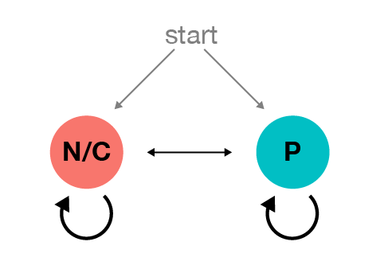

```{r data_prep_BC_re_class librairies and stuff, include = FALSE, eval = TRUE}
source("Scripts/00_setup.R")
```


```{r data_prep_BC_re_class setup, include=FALSE}
knitr::opts_chunk$set(echo = TRUE, cache = TRUE)
options(scipen=999)
```


## Birth control re-assignement per cycles 

### Motivations


The birth-control variable is a user-level variable.
Clue provided one birth-control method per user as the current one (or "on-boarding" one) provided by the user. 

Unfortunately, Clue did not (so far) provided the history of changes of this variable. If a user has changed birth-control, we are not aware of this change. Even if we had this history, users do not always change this variable in their setting.

However, from the tracking behavior and the information logged, we can observe birth control changes for some users.

Therefore, a re-classification of cycles regardin their current birth control method seemed appropriate to be able to compare pill users from non-pill users. This re-classification also allows for the study of symptoms over birth-control transitions.


### Method

In `00_cycle_classification_BC_expl.Rdm`, we have explored the best way to re-classify cycles according to the birth control method (pill vs none/condoms).

We identified input variables that were useful to classify cycles and tested several methods to re-classify these cycles.


The best strategy seems to be

1. train a classifier (here using Logistic Regression) on the original birth_control labels to obtain probabilities

2. define (and not train) a HMM to add memory in the assignation and use the viterbi algorithm to obtain the most likely BC.

3. define a confidence score for that new assignation that reflect the assymetry in the probability distribution (from 1.)

4. select users and cycles based on that confidence score.


### Loading data

Loading cycles

```{r data_prep_BC_re_class loading cycles}
#load(paste0(IO$output_data, "cycles.Rdata"), verbose = TRUE)
#dim(cycles)

load( paste0(IO$tmp_data, "cycles_with_input_variables.Rdata"), verbose = TRUE)
dim(cycles)

cycles$birth_control_CLUE = factor(cycles$birth_control_CLUE, levels = c("none / condoms","pill","did not enter"))
cycles$user_id_n = as.numeric(factor(cycles$user_id))

```


### Input variables

```{r data_prep_BC_re_class load input variables}
load(file = paste0(IO$tmp_data,"inputs.Rdata"), verbose = TRUE)
inputs
```


```{r data_prep_BC_re_class visualization of input variables}
# ,"score_n_days_obs","score_BC","score_CL"
for(input in inputs[-which(inputs == "cycle_start")]){
  if(input %in% colnames(cycles)){
    eval(parse(text = paste0("cycles$v = cycles$",input)))
    range_v = diff(quantile(cycles$v,p = c(0.1,0.9)))
    if(range_v>=5){binwidth = 1}else{binwidth = range_v/10}
    g =  ggplot(cycles, aes(x = v, col = birth_control_CLUE)) + 
      geom_freqpoly(aes(y = ..density..),binwidth = binwidth) +
      ggtitle(input) +
      scale_color_manual(values = c(cols$BC,"gray")) + 
      xlim(quantile(cycles$v,p = c(0.005,0.98), na.rm = TRUE)+c(-2*binwidth,2*binwidth))
    print(g)
  }else{print(paste0(input," is not in cycles\n"))}
}

j = which(colnames(cycles)=="v")
if(length(j)>0){cycles = cycles[,-j]}
```


### Classifying cycles using Logistic Regression


We only train on cycles of users that indicated `pill`, `none` or `condoms` and exclude users that `did not enter` their birth control in the settings.


```{r data_prep_BC_re_class logistic regression subset size}
subset_perc = 100
sample_size = round(subset_perc*nrow(cycles)/100)
sample_number_each_BC = min(sum(cycles$birth_control_CLUE == "pill", na.rm = TRUE), sum(cycles$birth_control_CLUE == "none / condoms", na.rm = TRUE))
sample_size = min(sample_size, 2*sample_number_each_BC)
min_sample_size = min(1000, 2*sample_number_each_BC)
sample_size = max(sample_size, min_sample_size)
sample_size
```


We use a balanced subset of  `r sample_size` cycles, selected randomly, to train the model.


```{r data_prep_BC_re_class logistic regression}

#sample_size = 100000

j_pill =  which(cycles$birth_control_CLUE == "pill")
j_pill = sample(j_pill, round(sample_size/2))
j_nc =  which(cycles$birth_control_CLUE == "none / condoms")
j_nc = sample(j_nc, round(sample_size/2))

j = c(j_pill, j_nc)
cycles_training_set = cycles[j , ]
cycles_training_set$birth_control_CLUE = factor(as.character(cycles_training_set$birth_control_CLUE), levels = c("pill", "none / condoms"))

tic()
eval(parse(text = paste0("
                         glm_fit = glm(birth_control_CLUE ~ ",paste(inputs, collapse = " + "),", 
                         data = cycles_training_set, 
                         family = 'binomial' )")))
tac(chunck_name = "data_prep_BC_re_class logistic regression") # takes about 20 seconds on the full dataset on sherlock
summary(glm_fit)

```


```{r data_prep_BC_re_class logistic regression prediction}

cycles$glm_prob = NA
j = 1:nrow(cycles)
#j = 1:10000

tic()
glm_prob = predict(glm_fit, newdata = cycles[j,inputs], type = "response")
tac(chunck_name = "data_prep_BC_re_class logistic regression prediction") # takes about 20 seconds on the full dataset on sherlock
head(glm_prob)

cycles$glm_prob[j] = 1-glm_prob


cycles$prob = cycles$glm_prob

```

```{r data_prep_BC_re_class save glm}
save(cycles, file = paste0(IO$tmp_data, "cycles_glm.Rdata"))
```


```{r data_prep_BC_re_class comparisons of classifier probs with original BC}

ggplot(cycles, aes(x =prob, fill = birth_control_CLUE )) + 
  geom_histogram(binwidth =  0.005, col = NA) + 
  geom_vline(xintercept = 0.5, linetype = 2)+ xlim(c(0,1))+ 
  scale_fill_manual(values = cols$BC3) + 
  facet_grid(birth_control_CLUE ~ .)

#comparison
table_cont = table(ifelse(cycles$prob<0.5,"NC","pill"), cycles$birth_control_CLUE)
table_cont 
round(t(t(table_cont)/apply(table_cont, 2, sum)), digits = 2)

rm(table_cont)
```


```{r data_prep_BC_re_class vizualization of classifier probabilities, fig.height= 9, fig.width=10}

sub_cycles = cycles[cycles$user_id %in% unique(cycles$user_id)[1:80],]
sub_cycles$user_id_n = factor(sub_cycles$user_id_n, levels = unique(sub_cycles$user_id_n[order(sub_cycles$birth_control_CLUE)]))

g = ggplot(sub_cycles, aes(x = cycle_nb, y = user_id_n, col = prob)) + 
  geom_point() + 
  facet_grid(birth_control_CLUE ~ ., scale = "free_y")+ 
  scale_color_gradient2(low = cols$NC, high = cols$pill, mid = "gray90", midpoint = 0.5)+
  theme(legend.position="top")

grid.arrange(g, nrow = 1)

rm(sub_cycles,g)

```


### Adding memory with an HMM



Model initialisation:


```{r data_prep_BC_re_class hmm: model initialization}
hmm = list()

# defining model
hmm$bc_states = c("none / condoms","pill") # hidden states
hmm$symbols = c(paste0("p_",0:10)) # observations

#initializing model

bc_emission_prob.N = c(dbeta(seq(0,1,by = 0.1), shape1 = 1 , shape2 = 3)+0.2) # more likely to observe LOW score for N/C
bc_emission_prob.P = c(dbeta(seq(0,1,by = 0.1), shape1 = 3 , shape2 = 1)+0.2) # more likely to observe HIGH score for pill

plot(seq(0,1,by = 0.1) , bc_emission_prob.N, type = "l", col = cols$NC, lwd = 2)
points(seq(0,1,by = 0.1) , bc_emission_prob.P, type = "l", col = cols$pill, lwd = 2)


# building and normalizing emission prob matrix
hmm$bc_emission_prob = matrix(c(bc_emission_prob.N,bc_emission_prob.P),nrow = length(hmm$bc_states), ncol = length(hmm$symbols), byrow = TRUE)
hmm$bc_emission_prob = hmm$bc_emission_prob/apply(hmm$bc_emission_prob, 1, sum)

rm(bc_emission_prob.N,bc_emission_prob.P)


hmm$p_stay_in_same = 0.90 # probability to stay in the same BC
hmm$bc_transition_prob = matrix(
  c( hmm$p_stay_in_same , 1 - hmm$p_stay_in_same,
     1 - hmm$p_stay_in_same , hmm$p_stay_in_same), 
  nrow = length(hmm$bc_states), ncol = length(hmm$bc_states), byrow = TRUE)

hmm$start_prob = c(1/2,1/2) 

hmm_mod = initHMM(
  States =  hmm$bc_states, Symbols =  hmm$symbols, 
  startProbs =  hmm$start_prob, transProbs =  hmm$bc_transition_prob, 
  emissionProbs =  hmm$bc_emission_prob)

```


Observations:

```{r data_prep_BC_re_class hmm with fit - observations are probabilities}
obs =  paste0("p_",round(10*cycles$prob))
```


Estimating most likely BC for each cycle using the Viterbi algorithm:


```{r data_prep_BC_re_class viterbi on init model}

my_viterbi = function(obs = obs){viterbi(hmm = hmm_mod, obs = obs)}

# running viterbi
tic()
vit_init = ave(obs, cycles$user_id, FUN = my_viterbi)
tac(chunck_name = "data_prep_BC_re_class viterbi on init model")

cycles$BC_hmm_init = vit_init

rm(vit_init, vit_init_no_x, hmm_mod, obs)
```


```{r data_prep_BC_re_class comparison with the original birth_control values}

table_cont_init_bc = table(cycles$BC_hmm_init, cycles$birth_control_CLUE)
round(t(t(table_cont_init_bc)/apply(table_cont_init_bc, 2, sum)), digits = 2)

```


```{r data_prep_BC_re_class save cy with HMM }
save(cycles, file = paste0(IO$tmp_data, "cycles_prob_HMM.Rdata"))
```


```{r data_prep_BC_re_class vizualization of HMM results, fig.height= 9, fig.width=14}


sub_cycles = cycles[cycles$user_id %in% unique(cycles$user_id)[1:80],]
sub_cycles$user_id_n = factor(sub_cycles$user_id_n, levels = unique(sub_cycles$user_id_n[order(sub_cycles$birth_control_CLUE)]))


g_vit_init = ggplot(sub_cycles, aes(x = cycle_nb, y = user_id_n, col = BC_hmm_init)) + geom_point() + facet_grid(birth_control_CLUE ~ ., scale = "free_y") + theme(legend.position="top")+ scale_color_manual(values = cols$BC)+guides(col = FALSE)
g_prob = ggplot(sub_cycles, aes(x = cycle_nb, y = user_id_n, col = prob)) + geom_point() + facet_grid(birth_control_CLUE ~ ., scale = "free_y")+ scale_color_gradient2(low = cols$NC, high = cols$pill, mid = "gray90", midpoint = 0.5)+ theme(legend.position="top")+guides(col = FALSE)

grid.arrange(g_vit_init, g_prob, nrow = 1)

rm(sub_cycles, g_prob, g_vit_init)

```

### Confidence Score

We define a confidence score that accounts for the assymetry in the probability distribution for pill vs N/C cycles.
The confidence score function is defined as the cumulative density function of the classifier probabilities for the cycles that stayed in the same BC class.

```{r data_prep_BC_re_class condidence score that reflects the assymetry in the probability distributions}

by = 0.001
h_pill = hist(cycles$prob[(cycles$birth_control_CLUE == "pill") & (cycles$BC_hmm_init == "pill")], breaks = seq(0-by/2,1+by/2,by = by), plot = FALSE)
h_nc = hist(1-cycles$prob[(cycles$birth_control_CLUE != "pill") & (cycles$BC_hmm_init != "pill")], breaks = seq(0-by/2,1+by/2,by = by), plot = FALSE)

h_pill = data.frame(mids = h_pill$mids, density = h_pill$density, cumsum = cumsum(h_pill$density)/max(cumsum(h_pill$density)))
h_nc = data.frame(mids = h_nc$mids, density = h_nc$density, cumsum = cumsum(h_nc$density)/max(cumsum(h_nc$density)))


confidence_thres = 0.1


g_pill = ggplot(h_pill, aes(x = mids, y = cumsum) )+ 
  geom_line()+ geom_point() + 
  geom_line(aes(y = density/10)) + 
  geom_hline(yintercept = confidence_thres)+
  xlab("prob") + ylab("confidence score")+
  ggtitle("pill confidence score")

g_nc = ggplot(h_nc, aes(x = mids, y = cumsum) )+ 
  geom_line()+ geom_point() + 
  geom_line(aes(y = density/10))+ 
  geom_hline(yintercept = confidence_thres)+
  xlab("prob") + ylab("confidence score")+
  ggtitle("none/condoms confidence score")

grid.arrange(g_pill, g_nc)

cycles$conf = 0
cycles$conf[cycles$BC_hmm_init == "pill"] = 
  h_pill$cumsum[match(round(cycles$prob[cycles$BC_hmm_init == "pill"],digits = 3),round(h_pill$mids, digits = 3))]
cycles$conf[cycles$BC_hmm_init != "pill"] = 
  h_nc$cumsum[match(round(1-cycles$prob[cycles$BC_hmm_init != "pill"],digits = 3),round(h_nc$mids, digits = 3))]


g = ggplot(cycles, aes(x = conf, fill = birth_control_CLUE))
g = g  + geom_histogram(alpha = 0.5, position = "identity", binwidth = 0.05) + 
  facet_grid( BC_hmm_init ~ . ) + 
  ggtitle("Distribution of cycles confidence score")
g + geom_vline(xintercept = confidence_thres, size = 0.3, linetype = 2)


```

```{r data_prep_BC_re_class confidence score viz examples, fig.height= 9, fig.width=14}

sub_cycles = cycles[cycles$user_id %in% unique(cycles$user_id)[1:80],]
sub_cycles$user_id_n = factor(sub_cycles$user_id_n, levels = unique(sub_cycles$user_id_n[order(sub_cycles$birth_control_CLUE)]))

g_vit_init = ggplot(sub_cycles, aes(x = cycle_nb, y = user_id_n, col = BC_hmm_init)) + geom_point() + facet_grid(birth_control_CLUE ~ ., scale = "free_y") + theme(legend.position="top")+ scale_color_manual(values = cols$BC) + guides(col = FALSE)

g_prob = ggplot(sub_cycles, aes(x = cycle_nb, y = user_id_n, col = prob)) + geom_point() + facet_grid(birth_control_CLUE ~ ., scale = "free_y")+ scale_color_gradient2(low = cols$NC, high = cols$pill, mid = "gray90", midpoint = 0.5)+ theme(legend.position="top")+ guides(col = FALSE)

g_conf = ggplot(sub_cycles, aes(x = cycle_nb, y = user_id_n, col = conf)) + geom_point() + facet_grid(birth_control_CLUE ~ ., scale = "free_y")+
  scale_color_gradientn(colours = c("red","gray90","black"), 
                        values = rescale(c(0,confidence_thres,1)),
                        limits=c(0,1))+
  #scale_color_gradient2(low = "red", high = "black",mid = "gray90", midpoint = confidence_thres, limits = c(0,2*confidence_thres))+
  theme(legend.position="top")+ guides(col = FALSE)

grid.arrange(g_vit_init, g_prob, g_conf, nrow = 1)
```


### New BC labels

* we take all users for which the new label is the same as the original label
* for users that have cycles with different or changing labels, we keep stretches of at least 4 cycles for which 
+ the confidence score of each cycle is above a given threshold and 
+ for which the running median confidence score over 3 cycles is above a higher threshold. 


```{r data_prep_BC_re_class cycle selection}

# keeping the cycles from users that had all their cycles matching the original BC
same = (cycles$birth_control_CLUE == cycles$BC_hmm_init)
same_u = aggregate(same, by = list(user_id = cycles$user_id), FUN = all)
user_ids_same_label = same_u$user_id[same_u$x]
cycle_ids_same = cycles$cycle_id[which(cycles$user_id %in% user_ids_same_label)]


# keeping the stretches of at least 4 cycles with confidence score higher than confidence_thres

o = order(cycles$user_id_n, cycles$cycle_nb)
cycles = cycles[o,]

#running_median_3 = function(x){n = length(x);X = cbind(c(NA,x[1:(n-1)]),x,c(x[2:n], NA)); return(apply(X,1,median, na.rm = TRUE))}
runmed_3 = function(x){runmed(x,k = 3)}
cycles$running_median_conf = ave(cycles$conf, cycles$user_id, FUN = runmed_3)

cycles$ok = (cycles$conf >= confidence_thres) & (cycles$running_median_conf >= 2 * confidence_thres)

#find_longest_stretch = function(x){with(rle(x), rep((lengths == max(lengths[values])) & values, lengths))} # if there are 2 stretches of the same length, this one takes both
#find_longest_stretch = function(x){
#  y = with(rle(x), rep(((1:length(lengths)) == which(values)[which.max(lengths[values])]) & values, lengths))
#  if(length(y) == 0){y = rep(FALSE, length(x))}
#  return(y)} # this one takes the first longest stretch

find_stretches = function(x,k = 4){
  y = 1*with(rle(x), rep((lengths >= k) & values, lengths))
  if(length(y) == 0){y = rep(0, length(x))}
  y = y * cumsum(diff(c(0,y))>0)
  return(y)
}

cycles$long_stretch = ave(cycles$ok, cycles$user_id, FUN = find_stretches)
cycle_ids_stretch = cycles$cycle_id[which(cycles$long_stretch > 0)]
# strech id
cycles$long_stretch[cycles$cycle_id %in% cycle_ids_same] = 1
cycles$stretch_id = paste0(cycles$user_id,"_",cycles$long_stretch)
cycles$stretch_id[cycles$long_stretch == 0] = NA

# merging these 2 list of cycle_ids
cycle_ids = union(cycle_ids_same, cycle_ids_stretch)

# new BC labels
j = which(cycles$cycle_id %in% cycle_ids)
cycles$BC = "unclear"
cycles$BC[j] = cycles$BC_hmm_init[j]

table_new_BC = table(cycles$BC)
table_new_BC
round(table_new_BC/sum(table_new_BC)*100,2)

table_BC = table(cycles$birth_control_CLUE, cycles$BC)
table_BC
round(table_BC/apply(table_BC,1,sum)*100,2)
```


```{r data_prep_BC_re_class save last cycles}
# cleaning cycles table
j = which(colnames(cycles) %in% c("ok","long_stretch"))
if(length(j)>0){cycles = cycles[,-j]}

#saving
save(cycles, file = paste0(IO$output_data,"cycles.Rdata"))
file.copy(from = paste0(IO$output_data,"cycles.Rdata"), to = paste0(IO$tmp_data,"cycles_BC_re_classification.Rdata"), overwrite = TRUE)
```


```{r data_prep_BC_re_class vizualization of final labels, fig.height= 9, fig.width=14}

sub_cycles = cycles[cycles$user_id %in% unique(cycles$user_id)[1:80],]
sub_cycles$user_id_n = factor(sub_cycles$user_id_n, levels = unique(sub_cycles$user_id_n[order(sub_cycles$birth_control_CLUE)]))


g_vit_init = ggplot(sub_cycles, aes(x = cycle_nb, y = user_id_n, col = BC_hmm_init)) + geom_point() + facet_grid(birth_control_CLUE ~ ., scale = "free_y") + theme(legend.position="top")+ scale_color_manual(values = cols$BC)
g_prob = ggplot(sub_cycles, aes(x = cycle_nb, y = user_id_n, col = prob)) + geom_point() + facet_grid(birth_control_CLUE ~ ., scale = "free_y")+ scale_color_gradient2(low = cols$NC, high = cols$pill, mid = "gray90", midpoint = 0.5)+ theme(legend.position="top")

grid.arrange(g_vit_init, g_prob, nrow = 1)

rm(sub_cycles, g_prob, g_vit_init)


sub_cycles = cycles[cycles$user_id %in% unique(cycles$user_id)[1:80],]
sub_cycles$user_id_n = factor(sub_cycles$user_id_n, levels = unique(sub_cycles$user_id_n[order(sub_cycles$birth_control_CLUE)]))
sub_cycles$BC = factor(sub_cycles$BC, levels = c(as.character(par$BC_dict$name),"unclear"))

g_BC = ggplot(sub_cycles, aes(x = cycle_nb, y = user_id_n, col = BC)) + geom_point() + facet_grid(birth_control_CLUE ~ ., scale = "free_y") + theme(legend.position="top")+ scale_color_manual(values = cols$BC3)

g_vit_init = ggplot(sub_cycles, aes(x = cycle_nb, y = user_id_n, col = BC_hmm_init)) + geom_point() + facet_grid(birth_control_CLUE ~ ., scale = "free_y") + theme(legend.position="top")+ scale_color_manual(values = cols$BC)

g_prob = ggplot(sub_cycles, aes(x = cycle_nb, y = user_id_n, col = prob)) + geom_point() + facet_grid(birth_control_CLUE ~ ., scale = "free_y")+ scale_color_gradient2(low = cols$NC, high = cols$pill, mid = "gray90", midpoint = 0.5)+ theme(legend.position="top")

g_conf = ggplot(sub_cycles, aes(x = cycle_nb, y = user_id_n, col = conf)) + geom_point() + facet_grid(birth_control_CLUE ~ ., scale = "free_y")+
  scale_color_gradientn(colours = c("red","gray90","black"), 
                        values = rescale(c(0,confidence_thres,1)),
                        limits=c(0,1))+
  #scale_color_gradient2(low = "red", high = "black",mid = "gray90", midpoint = confidence_thres, limits = c(0,2*confidence_thres))+
  theme(legend.position="top")

grid.arrange(g_BC, g_vit_init, g_prob, g_conf, nrow = 1)

rm(sub_cycles, g_BC, g_prob, g_vit_init, g_conf)


```


```{r data_prep_BC_re_class vizualization of final labels valid transition, fig.height= 9, fig.width=14}

agg = aggregate(BC ~ stretch_id + user_id, cycles[cycles$BC != "unclear",], lu)
sum(agg$BC > 1)

if(sum(agg$BC > 1)>0){
  
  sub_cycles = cycles[cycles$user_id %in% agg$user_id[which(agg$BC>1)[1:80]],]
  sub_cycles$user_id_n = factor(sub_cycles$user_id_n, levels = unique(sub_cycles$user_id_n[order(sub_cycles$birth_control_CLUE)]))
  sub_cycles$BC = factor(sub_cycles$BC, levels = c(as.character(par$BC_dict$name),"unclear"))
  
  g_BC = ggplot(sub_cycles, aes(x = cycle_nb, y = user_id_n, col = BC)) + geom_point() + facet_grid(birth_control_CLUE ~ ., scale = "free_y") + theme(legend.position="top")+ scale_color_manual(values = cols$BC3)
  
  g_vit_init = ggplot(sub_cycles, aes(x = cycle_nb, y = user_id_n, col = BC_hmm_init)) + geom_point() + facet_grid(birth_control_CLUE ~ ., scale = "free_y") + theme(legend.position="top")+ scale_color_manual(values = cols$BC)
  
  g_prob = ggplot(sub_cycles, aes(x = cycle_nb, y = user_id_n, col = prob)) + geom_point() + facet_grid(birth_control_CLUE ~ ., scale = "free_y")+ scale_color_gradient2(low = cols$NC, high = cols$pill, mid = "gray90", midpoint = 0.5)+ theme(legend.position="top")
  
  g_conf = ggplot(sub_cycles, aes(x = cycle_nb, y = user_id_n, col = conf)) + geom_point() + facet_grid(birth_control_CLUE ~ ., scale = "free_y")+
    scale_color_gradientn(colours = c("red","gray90","black"), 
                          values = rescale(c(0,confidence_thres,1)),
                          limits=c(0,1))+
    #scale_color_gradient2(low = "red", high = "black",mid = "gray90", midpoint = confidence_thres, limits = c(0,2*confidence_thres))+
    theme(legend.position="top")
  
  grid.arrange(g_BC, g_vit_init, g_prob, g_conf, nrow = 1)
  
  rm(sub_cycles, g_BC, g_prob, g_vit_init, g_conf)
  
}

sub_cycles = cycles[cycles$user_id %in% agg$user_id[which(agg$BC==1)[1:80]],]
sub_cycles$user_id_n = factor(sub_cycles$user_id_n, levels = unique(sub_cycles$user_id_n[order(sub_cycles$birth_control_CLUE)]))
sub_cycles$BC = factor(sub_cycles$BC, levels = c(as.character(par$BC_dict$name),"unclear"))

g_BC = ggplot(sub_cycles, aes(x = cycle_nb, y = user_id_n, col = BC)) + geom_point() + facet_grid(birth_control_CLUE ~ ., scale = "free_y") + theme(legend.position="top")+ scale_color_manual(values = cols$BC3)

g_vit_init = ggplot(sub_cycles, aes(x = cycle_nb, y = user_id_n, col = BC_hmm_init)) + geom_point() + facet_grid(birth_control_CLUE ~ ., scale = "free_y") + theme(legend.position="top")+ scale_color_manual(values = cols$BC)

g_prob = ggplot(sub_cycles, aes(x = cycle_nb, y = user_id_n, col = prob)) + geom_point() + facet_grid(birth_control_CLUE ~ ., scale = "free_y")+ scale_color_gradient2(low = cols$NC, high = cols$pill, mid = "gray90", midpoint = 0.5)+ theme(legend.position="top")

g_conf = ggplot(sub_cycles, aes(x = cycle_nb, y = user_id_n, col = conf)) + geom_point() + facet_grid(birth_control_CLUE ~ ., scale = "free_y")+
  scale_color_gradientn(colours = c("red","gray90","black"), 
                        values = rescale(c(0,confidence_thres,1)),
                        limits=c(0,1))+
  #scale_color_gradient2(low = "red", high = "black",mid = "gray90", midpoint = confidence_thres, limits = c(0,2*confidence_thres))+
  theme(legend.position="top")

grid.arrange(g_BC, g_vit_init, g_prob, g_conf, nrow = 1)

rm(sub_cycles, g_BC, g_prob, g_vit_init, g_conf)
rm(agg)


```


```{r data_prep_BC_re_class visualization of input variables WITH NEW BC labels}
# ,"score_n_days_obs","score_BC","score_CL"
for(input in inputs[-which(inputs == "cycle_start")]){
  if(input %in% colnames(cycles)){
    eval(parse(text = paste0("cycles$v = cycles$",input)))
    range_v = diff(quantile(cycles$v,p = c(0.1,0.9)))
    if(range_v>=5){binwidth = 1}else{binwidth = range_v/10}
    g =  ggplot(cycles, aes(x = v, col = BC)) + 
      geom_freqpoly(aes(y = ..density..),binwidth = binwidth) +
      ggtitle(input) +
      scale_color_manual(values = c(cols$BC,"gray")) + 
      xlim(quantile(cycles$v,p = c(0.005,0.98), na.rm = TRUE)+c(-2*binwidth,2*binwidth))
    print(g)
  }else{print(paste0(input," is not in cycles\n"))}
}

j = which(colnames(cycles)=="v")
if(length(j)>0){cycles = cycles[,-j]}
```


