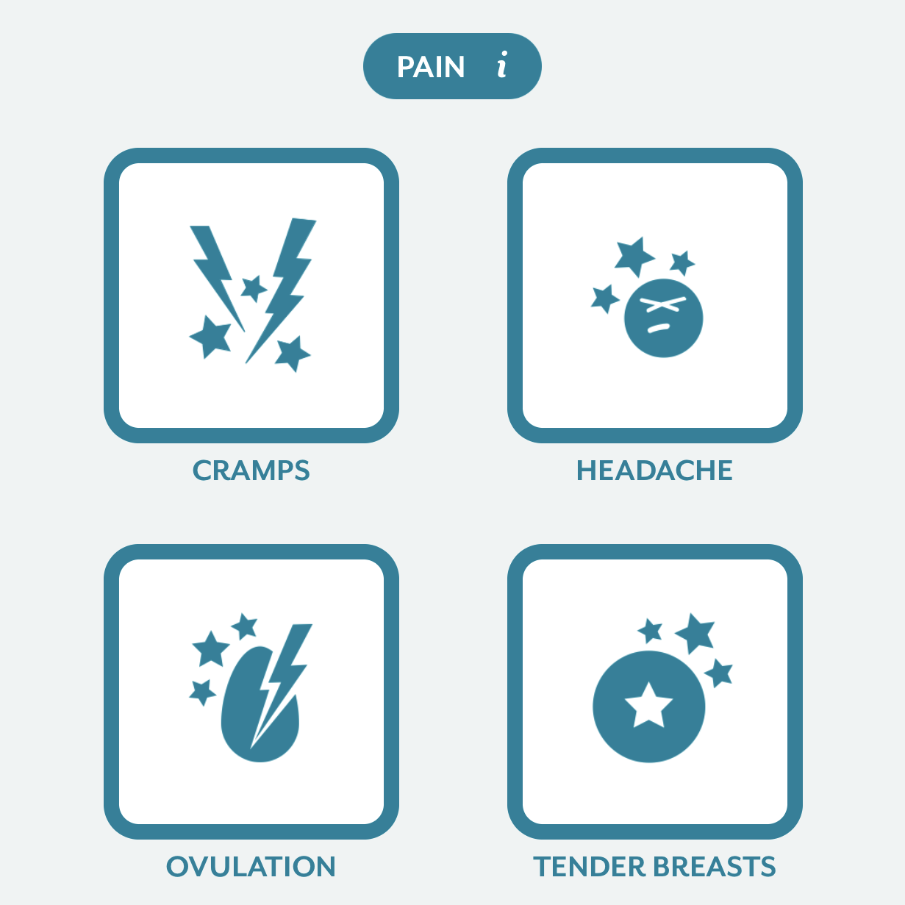

```{r intro_Clue_app librairies and stuff, include = FALSE, eval = TRUE}
source("Scripts/00_setup.R")
```


```{r intro_Clue_app setup, include=FALSE}
knitr::opts_chunk$set(echo = TRUE, cache = TRUE)
options(scipen=999)
```


# the Clue app & Clue data overview

The [Clue app](https://helloclue.com) allow users to track their period-related symptoms, body signs and activities.
Among their tracking options, they provide their users with the possibility to track 4 different types of physical pain: **cramps**, **headaches**, **tender breasts** and **ovulation pain**.



Here, we will focus on breast tenderness.


Original data provided by Clue include

- a `users` table with the following columns


```{r intro_Clue_app loading Clue data users, echo = FALSE}
load(file = paste0(IO$input_data,"users_filtered.Rdata"), verbose = TRUE)
```

```{r intro_Clue_app users}
colnames(users)
```


- a `cycles` table with the following columns: 


```{r intro_Clue_app loading Clue data cycles, echo = FALSE}
load(file = paste0(IO$input_data,"cycles_filtered.Rdata"), verbose = TRUE)
```

```{r intro_Clue_app cycles}
colnames(cycles)
```


- a `tracking` table with the folling columns: 


```{r intro_Clue_app loading one tracking table, echo = FALSE}
load(paste0(IO$input_data,"tracking_filtered/tracking_filtered_split_aa.Rdata"), verbose = TRUE)
```

```{r intro_Clue_app tracking}
colnames(tracking)
```


Snippet from one of the tracking tables:

```{r intro_Clue_app showing tracking table example}
tail(tracking)
```


Clue provided data for:

```{r intro_Clue_app number of users & cycles, echo = FALSE}
cat("number of users: ",nrow(users),"\n")
cat("number of cycles: ",nrow(cycles),"\n")
#cat("number of log tender breasts: ", sum(users$n_tender_breasts),"\n")
#cat("number of log pill: ", sum(users$n_pill),"\n")
```


