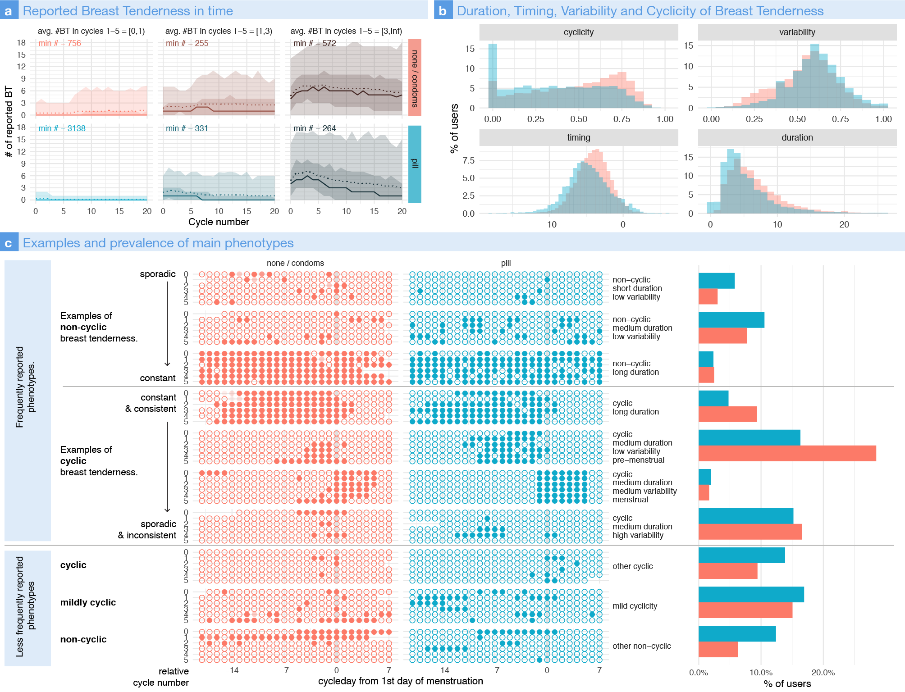

# Abstract

**Background**

Millions of women are now using smartphone apps to track their menstrual cycles and associated symptoms, such as mastalgia (breast tenderness and pain). Breast tenderness is described as painful or uncomfortable sensations in the breast, sometimes with a change of volume or consistency of the breasts themselves.  The prevalence, intensity, timing and duration of mastalgia have not been optimally characterized. For many women there is a cyclic association with the menstrual cycle indicating a hormonal association, although the specific causes of pain are not well established. 

**Objectives**

The aims of the study were to describe how and when this symptom is reported by users of such apps, and to evaluate the predictive power of users’ demographic and birth control choices for the occurrence and reporting frequency of this symptom. We also wished to investigate if there were distinct patterns of symptoms reported by different users and, finally, to evaluate the changes in symptom reporting for users going on or off the contraceptive pill.

**Study Design**

Here, we leveraged the self-reports of smartphone app users and analyzed a retrospective large dataset of over 200,000 users of the Clue app with over 4.5 million reported symptoms of breast tenderness. 

**Results**

We found that contraceptive pill users report fewer symptoms of breast tenderness on average than non-pill users.  The oral contraceptive pill decreased the symptom of mastalgia for 48% of users who switched birth control but increased symptoms for 32% of users (with the remaining 20% experiencing no change). The user’s age is the second most powerful predictor for the symptom prevalence: older users reported symptoms earlier in the pre-menstrual phase and for longer durations. It was also found that 15-18% of users reported symptoms that could not be clearly differentiated as cyclic vs non-cyclic mastalgia; rather there are a wide variety of patterns of duration, consistency and phases in relationship to the menstrual cycle. We discuss how this categorization may have emerged in early studies on 

**Conclusion(s)**

While this study confirms associations between steroid hormonal use and breast tenderness symptoms at the population and at the individual level, it also shows that the most affected users experience specific and consistent patterns in terms of timing and duration of their symptoms, which may reflect their underlying hormonal profiles. 

# Figures

## Figure 1

Data collection, Dataset, Tracking behavior and Aggregated Reported Symptoms of Breast Tenderness

## Supplementary Figure

Breast tenderness predictors

## Figure 2

Breast tenderness phenotypes

## Figure 3

Breast Tenderness at pill transitions

# Pre-print

The current version of the paper can be downloaded on !! [medRxiv](XXX) !!

# Peer-reviewed published article
Coming soon

# Figures, Code and Data

Code and aggregated data to reproduce the figures can be found and downloaded on the github repo !! [TB-Public-Repo](https://github.com/lasy/TB-Public-Repo) !! .

Specifically, click !! [here](https://lasy.github.io/TB-Public-Repo/Code/Tender_Breasts_FIGURES.html) !! for the rendered  !! [Rmd](https://github.com/lasy/TB-Public-Repo/blob/master/Code/Tender_Breasts_FIGURES.Rmd) !! (R code // R markdown) used to generate the Figures.

This link will bring you to the rendered R markdown for the full analysis of the data: [Analysis](https://github.com/lasy/TB-Public-Repo/blob/master/Code/Tender_Breasts_ANALYSIS.html)

# Contact
Any question or request can be addressed at Laura Symul 

[lsymul@stanford.edu](mailto:lsymul@stanford.edu) 

[laurasymul@gmail.com](mailto:laurasymul@gmail.com) 

[lsy.works](http://lsy.works/)

[twitter](https://twitter.com/LauraSymul) @LauraSymul

